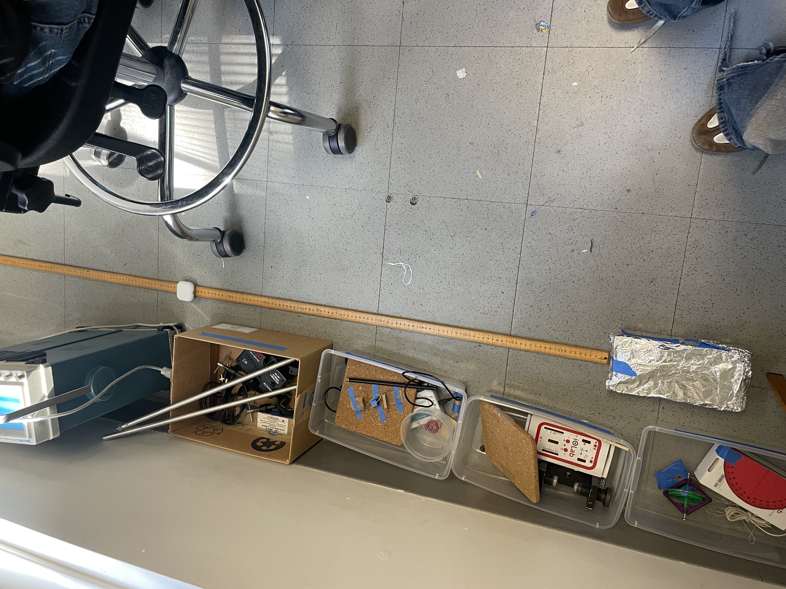
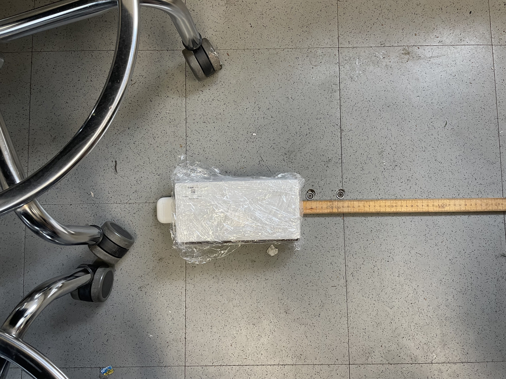
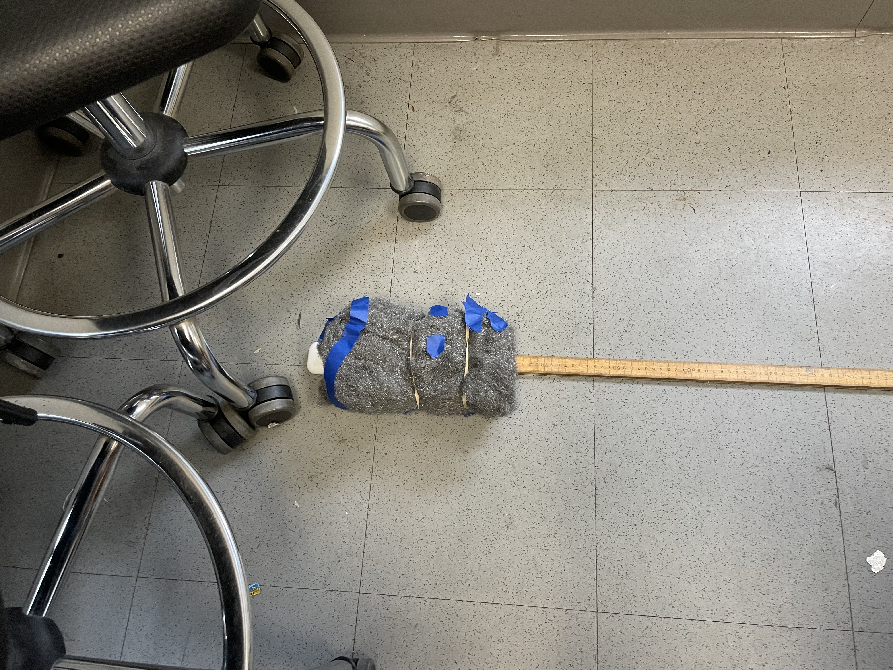
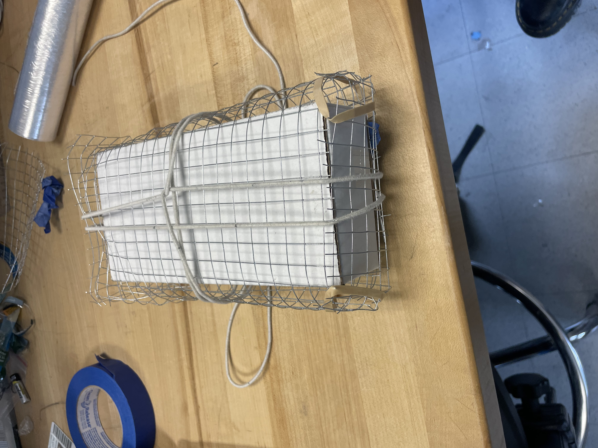
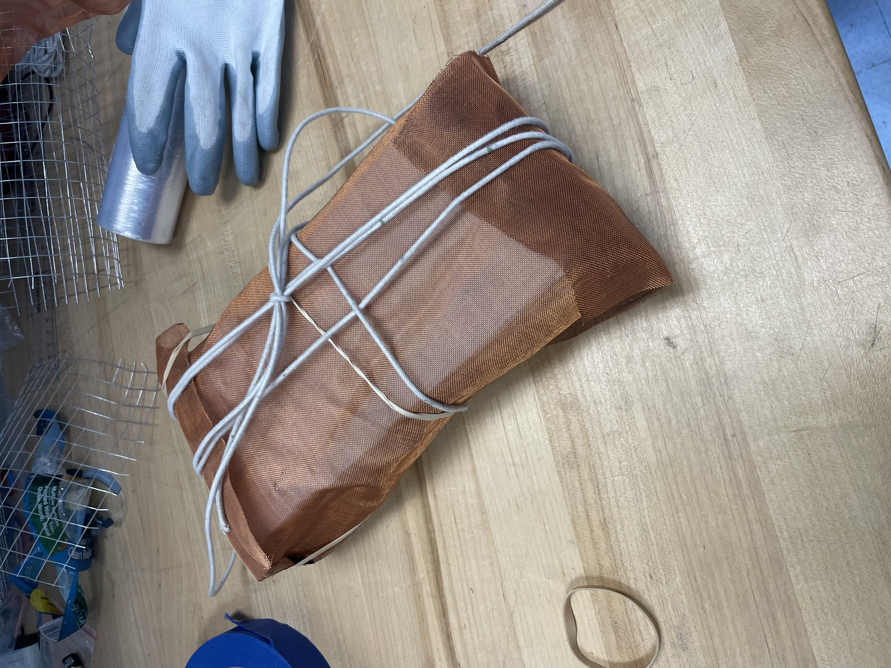

## Understanding the Theory 
- [Derivation of Shielding Effectiveness (SE)](https://learnemc.com/shielding-theory#:~:text=where%20the%20total%20shielding%20effectiveness,wave%20propagates%20through%20the%20material.)
- More resources in Griffiths, Electrodynamics. 
#### Wave attenuation
- A cage is efficient if the conductor is significantly thicker than the skin depth for the target frequency (thickness> 3-5 skin depths)
- Higher frequencies thus do not require particualrly thick coating, wiereas low frequencies require thicker, more conductive materials. 
- Mesh hole size << wavelength for the cage to be effective
- Apple airpods use the Bluetooth 5.0, i.e. 2.402 to 2.480 GHz frequency range. 
- With speed of light in air, this corresponds to about 12.09 cm to 12.48 cm. Holes we are texting are about 1 order of magnitude smaller than these.

## Mon Apr 13
- Got a box that would be able to fit an iPhone 
- Wrapped it in mesh (that had holes); this didn't work 
- Tried a range of apps that measured RSSI strenght, these were not effective.

## Wed Apr 15
- Decided to go with Bluetooth because the wifi router that we had would be a bit too big to fit in our box 
- Theoretically, the 
- Testing with aluminium foil, sandpaper should be the control

### Designing experimental procedure 
- (1) Make an outline of the metal that will surround the box, keeping one side open such that we can insert the box carefully.
- (2) Start the screenrecording on the phone and start a stopwatch (simultaneously if possible).
- (3) Place the phone inside at the edge of the box. 
- (4) Carefully slide the box in the wrapping. The box should touch the airpods. 
- (5) Record the time at which we should start taking measurements.
- (6) Leave the phone in the box for an extra 30s. 
- (7) Through the screenrecording, take measurements at a 1Hz rate (this should yield 30 measurements), and compile them into an array. 
- (8) Repeat for different geometries and distances 
- The geometries we will test are aluminium foil, fine mesh, chicken wire, steel wool, and the control.  The distances we will test are 0m, 1m, and 2.5m (+ 1.4 cm + material thickness)
- Each separate day the measurement is carried out, a control should be taken of the box without any conductive material wrapping, as the surrounding bluetooth sources will change; this way, we can standardise data across days.

This experimental procedure should yield the following data table:
| Material | Distance | RSSI| Control RSSI |
| :--- | :--- | :--- | :--- | 
| Aluminium| 0m | | | 
| Aluminium| 1m | | | 
| Aluminium| 2.5m | | | 
| Fine Mesh| 0m | | | 
| Fine Mesh| 1m | | | 
| Fine Mesh| 2.5m | | | 
| Chicken Wire| 0m | | | 
| Chicken Wire| 1m | | | 
| Chicken Wire| 2.5m | | | 
| Steel Wool | 0m | | | 
| Steel Wool| 1m | | | 
| Steel Wool| 2.5m | | |

#### Control, 0m
- 1st hearted video
- 7s - 37s

#### Control, 1m
- 4th hearted video
- 1 min 4s - 1 min 34s

#### Control, 2.5m
- 4th hearted video
- 19s - 49s

#### Aluminium foil, 0cm
- 2nd hearted video 
- 1min 11s - 1m min 41s

#### Aluminium foil, 1m
- 3rd hearted video
- 2min 9s to 2min 39s

#### Aluminium foil, 2.5m
-3rd hearted video
-4min to 4 min 30

## Mon Apr 20

#### Ceram wrap, 0m
- 5th hearted video
- 48s to 1min18s

#### Ceram wrap, 1m
- 5th hearted video 
-2min15s to 2min45s

#### Ceram wrap, 2.5m
- 5th hearted video 
-3min8s to 3min 38s

#### Background, 0m
- 6th hearted video
- 12s to 42s

#### Background, 1m
- 6th hearted video 
-1min07s-1min37s

#### Background, 2.5m
- 6th hearted video 
-1min51s to 2min21s

#### Steel wool, 0m
-7th hearted video
- 8:58-9:28

#### Steel wool, 1m
-7th hearted video
- 10:00-10:30

#### Steel wool, 2.5m
-7th hearted video
- 10:45-11:15

## Wed Apr 22

#### Chicken wire, 0m
- 8th hearted video
-7:15-7;45

#### Chicken wire, 1m
- 8th hearted video
-8:02-8:22 

#### Chicken wire, 2.5m
- 8th hearted video
-8:50-9:20

#### Copper mesh, 0m
- 9th hearted video
-5:30-6:00

#### Copper mesh, 1m
- 9th hearted video
-4:50-5:20

#### Copper mesh, 2.5m
- 9th hearted video
-6:26-6:56

### Quantifying material thickness

| Material | Thickness | 
| :--- | :--- |
| Nothing (background) | |
| Control (ceram wrap) | 0.0005" |
| Aluminium foil | 0.001" |
| Steel wool | 2.675"|
| Chicken Wire | 0.1" |
| Copper mesh| 0.02"|

### Quantifying Hole Size

| Material | Hole size | 
| :--- | :--- |
| Nothing (background) | N/A |
| Control (ceram wrap) | N/A |
| Aluminium foil | N/A |
| Steel wool | Fibre diameter 2-5 mm |
| Chicken Wire | 0.5" x 0.5" |
| Copper mesh| 178x178 microns |