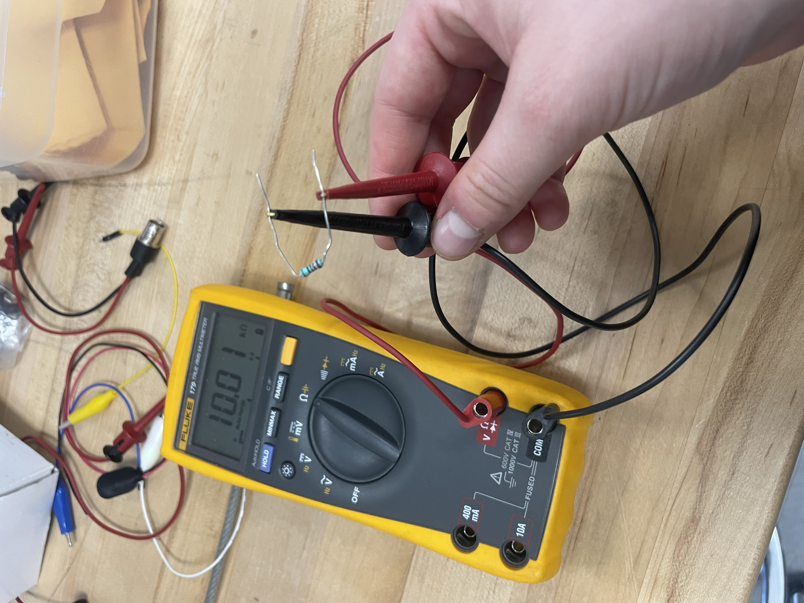
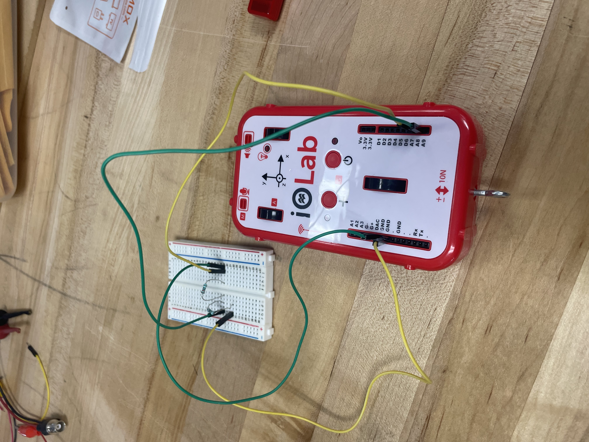
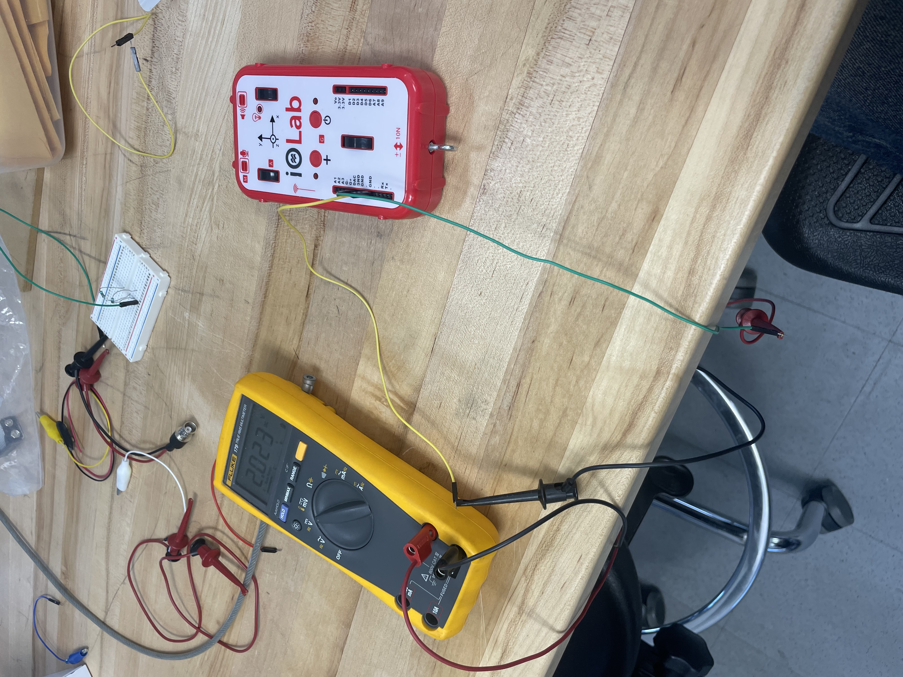
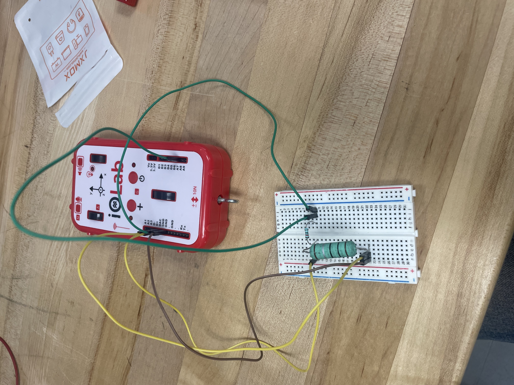
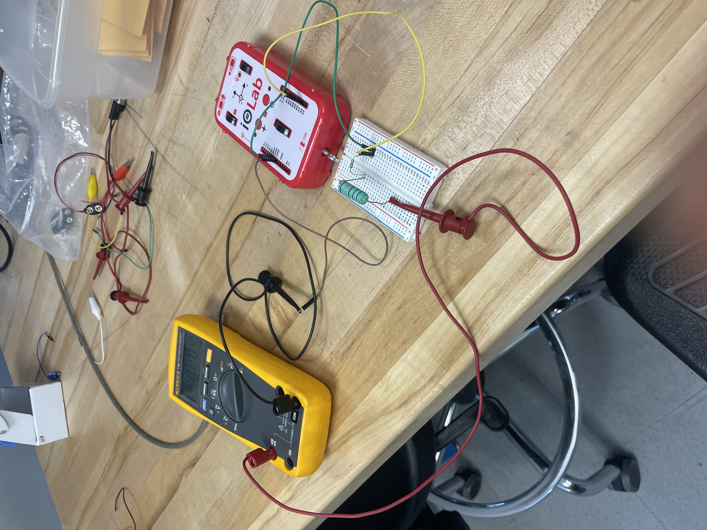
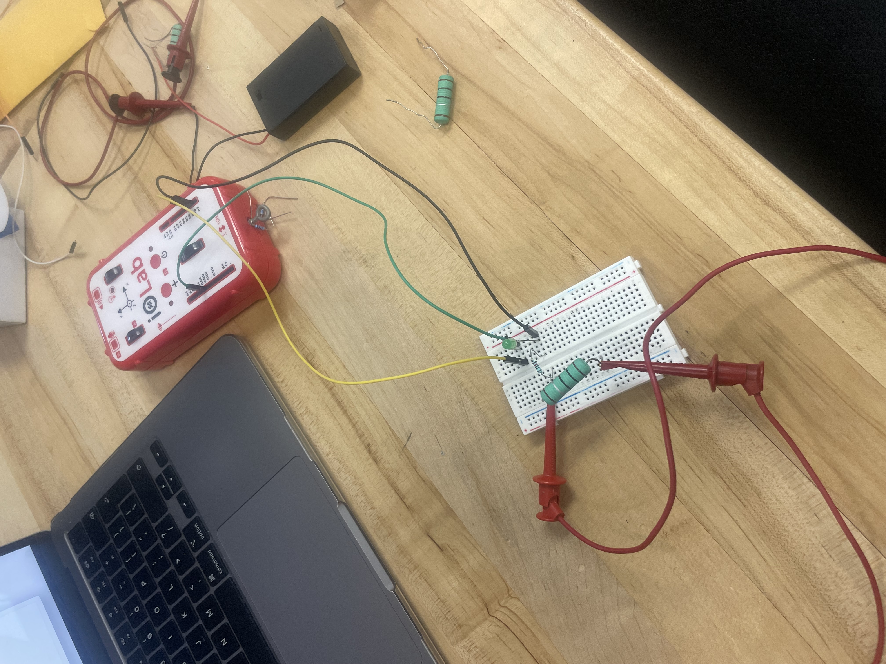
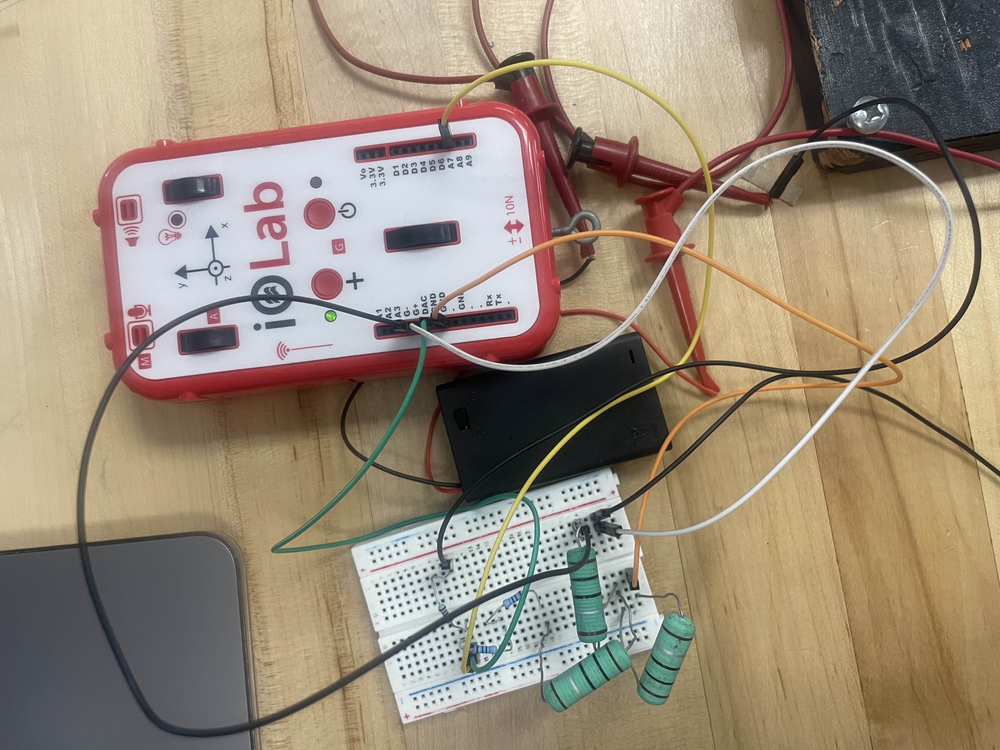

# Lab Notebook

## Part 0 - DMM
Put in the black and red banana test leads in the relevant part of the DMM. 
#### 1st measurement (Ines):
    • Picked a 10kohm resistor. 
    • Measured the resistance to be 10.01kohms.
#### 2nd measurement (Arjun): 
    • Picked a 4.7kohm resistor. 
    • Measured the resistance to be 4.684kohms.

## Part 1 - iOLab & DMM
### 1A - Resistors in series/Voltage Divider
#### 1st measurement (Ines):
    • Connected wires to 3.3V, A8, GND, formed the circuit
    • DAC --> Output mode, expert, Output was set to 2.0V.
    • Set up the DAC in the ioLAb app.
    • Started recording the data, but the data did not fluctuate when turning DAC on and off. 
    • Is this a software bug?
    • The DAC was set to 2.5V, and then back to 2.0V. 
    • The data still did not fluctuate. 
    • The breadboard was connected wrong, and was reconnected according to Figure 6 in the lab manual. 
    • New data was recorded. 
    • The data now fluctuates when DAC is turned on and off, which is promising. 
    • However, the A7 reading is 1.8V. 
    • The DAC was accidentally set to 1.8V, and was changed to 2.0V. 
    • A7 now reads 1.8V, even though the DAC was set to 2.0V. 
    • This is a software lag, and the DAC was set to 2.5V then back to 2.0V. 
    • A7 now reads 2.0V, as required. 
    • The data was saved.
#### 2nd measurement (Arjun):
    • Measurement went as expected and the data was saved.

### Using DMM to measure voltage
#### 1st measurement (Ines):
    • The circuit was unplugged and the DMM was connected to iOLab DAC and GRND. 
    • The measured value was 1.802V. 
    • This is a software error, so the ioLab was set to 2.5V then back to 2.0V. 
    • The measured voltage was 2.0225 (fluctation between 2.022 and 2.023).
#### 2nd measurement (Arjun):
    • Measured the DAC across the ioLab was 2.0225 (fluctation between 2.022 and 2.023). 

### 1B - Measuring Current
#### 1st measurement (Ines):
    • Circuit was set up.
    • When data was taken the high G gain sensor reading was above 1mV. 
    • A 1 kohm resistor instead of 1ohm resistor was used. 
    • The resistor was switched out for a 1ohm resistor.
    • Data was recorded and repository.
    • Note to selves: The G+/- data will need to be offset.
#### 2nd measurement (Arjun):
    • Data was recorded and saved to the repository.
#### In class self-check: 
    • I = V/R = 0.142+0.049mV/1ohm = 0.191mA.

### Using DMM to measure current
#### 1st measurement (Ines):
    • Current was 0.0205mA (fluctuated between 0.02mA and 0.021mA)
#### 2nd measurement (Arjun):
    • Current was 0.20mA.

## Part 2 - Ohmic and Non-Ohmic Behaviour
### 2A - Ohmic Behaviour
#### 1st set of measurements (Ines):
    • The setup was kept the same as in experiment 1B. 
    • DAC values were recorded using the iOLab.
| DAC (V) | Current (mA) |
| :--- | :--- |
| 0.1 | 0.01 |
| 0.4 | 0.04 |
| 0.7 | 0.08 |
| 1.0 | 0.10 |
| 1.3 | 0.13 |
| 1.6 | 0.16 |
| 1.9 | 0.195 |
| 2.2 | 0.22 |
| 2.5 | 0.26 |
| 2.9 | 0.29 |
| 3.3 | 0.33 |

#### 2nd set of measurements (Arjun):
| DAC (V) | Current (mA) |
| :--- | :--- |
| 0.1 | 0.01 |
| 0.4 | 0.04 |
| 0.7 | 0.07 |
| 1.0 | 0.10 |
| 1.3 | 0.13 |
| 1.6 | 0.16 |
| 1.9 | 0.19 |
| 2.2 | 0.22 |
| 2.5 | 0.26 |
| 2.9 | 0.29 |
| 3.3 | 0.33 |

### 2B - Non-Ohmic Behaviour
#### 1st set of measurements (Ines):
    • Setup was kept the same as in 2A, but a green LED was added to the circuit.
    • Ranges was tested and it was from 1.9V-3.3V. 
    • 3.3-2.1/10 = 0.12 = approx 0.1, so 0.1V increments were selected.
| DAC (V) | Current (mA) |
| :--- | :--- |
| 2.1 | 0.01 |
| 2.2 | 0.02 |
| 2.3 | 0.025 |
| 2.4| 0.035 |
| 2.5 | 0.05 |
| 2.7 | 0.06 |
| 2.9 | 0.07 |
| 3.1 | 0.10 |
| 3.2 | 0.10 |
| 3.3 | 0.12 |
#### 2nd set of measurements (Arjun):
• Setup was kept the same; red LED was used instead.
• Ranges was tested and it was from 1.9V-3.3V. 
• 3.3-1.6/10 = 0.17 = approx 0.2, so 0.2V increments were selected.
| DAC (V) | Current (mA) |
| :--- | :--- |
| 1.6 | 0.005 |
| 1.7 | 0.01 |
| 1.8 | 0.02 |
| 2.0| 0.03 |
| 2.2 | 0.05 |
| 2.4 | 0.07 |
| 2.5 | 0.08 |
| 2.8 | 0.11 |
| 3.0 | 0.13 |
| 3.2 |0.15 |
| 3.3 | 0.16 |

### 3A - Kirchoff's Laws
• The battery pack was measured to be 4.379V using the DMM. The battery pack could not be deconstructed into the individual batteries. 
• The white wire was plugged into G+; the black one in G-. 
#### 1st set of measurements (Ines):
• The sequence of measurements was current across middle resistory (I3), bottom left resistor (I1), bottom right resistor (I2). 
#### 2nd set of measurements (Arjun):
• The sequence of measurements was current across middle resistory (I3), bottom left resistor (I1), bottom right resistor (I2). 

Note: Arjun was not present in person for the data collection. His dataset was collected via Zoom, where he visually read metres where possible. He assisted in the circuitry setup.