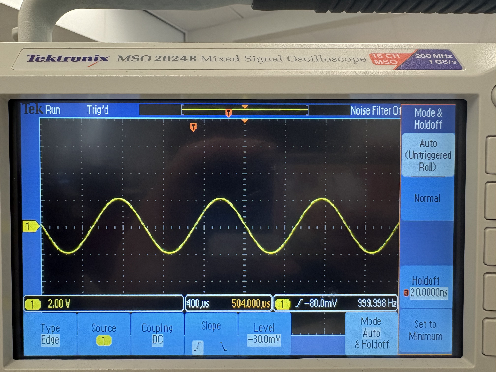
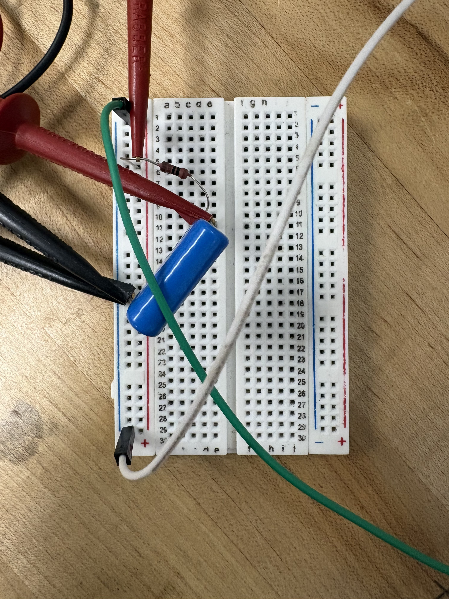
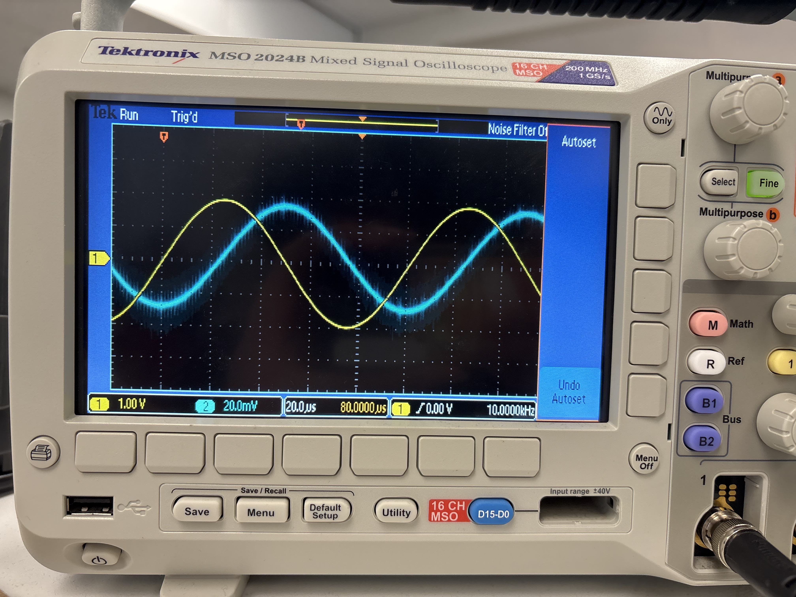

# Lab Notebook
## Part 0 Experimental procedure
1. The function generator was connected directly to the oscilloscope and configured to produce a 1.00 kHz, and 4.0 Vpp sine wave.
  4
2. The oscilloscope vertical and horizontal scales were adjusted until several cycles of the waveform were clearly visible.
3. The waveform amplitude and period were determined from the screen using the number of divisions and the volts-per-division and seconds-per-division settings.
4. Trigger settings were varied to observe the effect of trigger slope, trigger level, and acquisition mode on the displayed waveform.
5. The vertical scale and horizontal time base were changed to verify that the displayed divisions changed while the physical signal amplitude and period remained constant.

## Part 1 Experimental procedure
A series RC circuit was assembled. It was composed of a 1.0 k resistor and a 1 F capacitor.
The function generator was connected across the circuit and produced a constant-amplitude sine wave.
 7
 Figure 6: RC Circuit Breadboard
CH1 on the oscilloscope was connected across the function generator output to measure V0, and CH2 was connected across the capacitor to measure Vc.
The generator frequency was varied over a roughly logarithmic range from 50 Hz to 10kHz.
At each frequency, the input amplitude, capacitor amplitude, and phase shift between the two channels were recorded.
The amplitude ratio VC/V0 was plotted against angular frequency , and the data was fit to the theoretical low-pass form.
The phase data were plotted separately and compared with the theoretical phase relation for an RC low-pass filter.

## Part 2 Experimental procedure
A series RL circuit consisting of a 1.0 k resistor and a 100 mH inductor was constructed.
The function generator was connected across the circuit and set to produce a sine wave of with constant amplitude.
CH1 on the oscilloscope was connected across the generator output to measure V0; CH2 was connected across the inductor to measure VL.
The generator frequency was varied from 500 Hz to 50 kHz.
At each frequency, the input amplitude, inductor amplitude, and phase difference between the two channels were recorded.
The amplitude ratio VL/V0 was plotted as a function of angular frequency and fit to the theoretical high-pass RL response.
The phase data was also plotted and compared with the theoretical expression for an ideal RL high-pass filter.